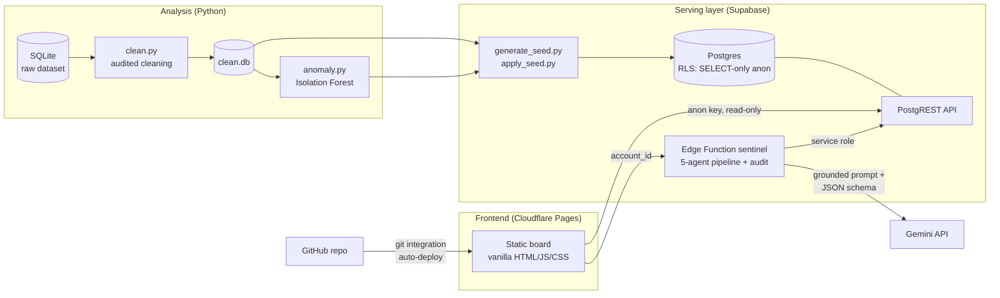

# Fraud & Compliance Exploration Board

A portfolio project that turns a risk & compliance dataset into a **live, self-serve
exploration tool**: cleaning pipeline → interpretable ML anomaly detection → read-only
serving layer → web board with an AI sentinel grounded on the served data.

**Live board:** https://fraud-exploration.pages.dev
**Headline insights:** see [Key findings](#key-findings-from-the-eda) below, or the board's Findings tab.
**Design docs:** [docs/](docs/)

> **Disclaimer** — Personal portfolio project inspired by a hiring assessment, built
> entirely on a **dummy dataset**. Not affiliated with, or endorsed by, Nuvei or any
> payments company. No real customer data is used anywhere.

## Architecture



## The board — seven tabs, one narrative

| Tab | What it shows |
|---|---|
| **Power BI** | The Layer-1 report embedded (Publish-to-web) — the four dashboard pages, inside the board. |
| **EDA** | Exploratory analysis over the raw serving layer: the six source tables, filterable column by column, with a live data-quality panel. |
| **ETL** | The cleaning pipeline as audited treatments (live from `cleaning_log`), each with before→after examples and integrity checks. |
| **DSS** | Descriptive statistics, distributions and associations over the cleaned data. |
| **Findings** | The KPI grid plus thematic deep-dives, each with an evidence chart, per-mark tooltips and a "how to read" note. |
| **ML Model** | Why Isolation Forest, the behavioral features, a real parameter-sensitivity sweep, and the three-tier explained anomaly lists (transaction / account / customer). |
| **AI Engine** | The sentinel's internals — five-agent pipeline, tools, model wrapper with retry/fallback, anonymization, injection defenses — plus the live runner with a per-agent audit table. |

## Stack rationale

| Choice | Why |
|---|---|
| **Supabase (Postgres + PostgREST)** | A serving layer with real row-level security: the anon key shipped to the browser can only `SELECT`. Write privileges are revoked *and* no write policy exists — defense in depth. |
| **Cloudflare Pages, no build step** | The board is vanilla HTML/JS/CSS; deploys on every push through the GitHub integration. Nothing to compile, nothing to break. |
| **Supabase Edge Function for the sentinel** | The Gemini key must never reach the client. Inside, a **five-agent pipeline** (profile → behavior → ML interpretation → synthesis → compliance QA) with one model wrapper (retry, backoff, fallback chain), PII pseudonymization by construction, prompt-injection framing, Postgres-enforced rate limits and a per-agent audit trail. |
| **Isolation Forest at account level** | Unsupervised, fits a no-labels compliance setting, and stays **explainable**: every flagged account shows *which* behavioral features deviate and by how much. |

**Production note:** here Postgres serves both roles for simplicity. In a production
deployment the analytical layer (heavy aggregation, model features, backtesting) would
live in a warehouse such as **BigQuery or Snowflake**, with the operational serving
layer fed from curated marts — and PII would be masked before any of it reaches an
exploration tool or a model.

## Key findings (from the EDA)

1. **$4.3M in transactions to sanctioned jurisdictions were flagged but never alerted**
   (147 of 170); overall, 87% of flagged transactions never became a case. Detection
   works; escalation doesn't.
2. **Confirmed sanctions matches keep transacting** — 4 confirmed matches, zero
   resolved, ~$1.85M moved after matching; 34% of customers were never screened.
3. **A structuring pattern hides in plain sight**: 276 transactions (17%) sit in the
   $9,000–9,999 band — 3.3× the neighboring bands — yet only 9 structuring alerts exist.
4. **Account-status controls are not enforced**: $15.3M flowed through Closed, Dormant
   and Frozen accounts; the `is_international` flag is unreliable.
5. **Monitoring hasn't scaled and is mis-aimed**: volume tripled while alerting stayed
   flat; 77% false-positive rate; the KYC risk rating shows no relationship with actual
   behavior (Cramér's V = 0.05). A three-tier ML stack (transaction / account / customer)
   surfaces what the rules miss: $424K needle wires, $1.9M through a dormant High-risk
   account, and a customer structuring across 4 of their own accounts.

Cleaning audit trail: [outputs/cleaning_log.csv](outputs/cleaning_log.csv). Full statistical
detail, methodology and the associations are explorable in the board's EDA, ETL and DSS tabs.

## Repository layout

```
analysis/    clean.py, anomaly.py, feature builders, model + three-tier scripts, export scripts
data/        raw + cleaned SQLite (dummy data, safe to commit)
outputs/     cleaning log + model score CSVs (transaction / account / customer)
app/         static frontend (Cloudflare Pages root; js/ modules, data/ precomputed stats)
supabase/    seed generator + applier, edge function (5-agent sentinel), rate limit, audit
powerbi/     Power BI package — layout_spec.md, measures.md, theme.json
docs/        PRD, TRD, DATABASE, UI, APPFLOW, CONVENTIONS, MOCKUPS
```

## Reproduce

```bash
pip install pandas scikit-learn scipy
python analysis/clean.py                # rebuilds data/clean.db + cleaning log
python analysis/anomaly.py              # rebuilds model scores
python analysis/export_eda_stats.py     # rebuilds app/data/eda_stats.json
python analysis/model_sensitivity.py    # rebuilds app/data/model_sensitivity.json
python supabase/generate_seed.py        # regenerates supabase/seed.sql
SUPABASE_ACCESS_TOKEN=... python supabase/apply_seed.py   # applies it (Management API)
```

Frontend: open `app/index.html` through any static server (`python -m http.server`).
Sentinel: `supabase functions deploy sentinel` + `supabase secrets set GEMINI_API_KEY=...`.

## Privacy & AI-safety notes

- **Dummy data only.** In production, PII would be masked or tokenized before reaching
  an exploration tool, and models would run in a controlled environment.
- The sentinel **reasons only over data served to it** and returns a constrained JSON
  schema — a recommended action from a fixed six-step ladder (Close as false positive →
  Continue standard monitoring → Enhanced monitoring → Initiate sanctions screening → Request
  KYC refresh → Escalate to compliance review), plus next steps and an evidence-strength grade
  computed in code from a deterministic signal checklist. Account data is wrapped as third-party
  *data*, not instructions, to resist prompt injection.
- The anon key in `app/config.js` is intentionally public: RLS limits it to `SELECT`.
