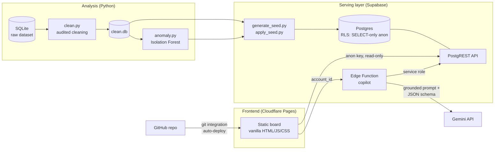

# Fraud & Compliance Exploration Board

A portfolio project that turns a risk & compliance dataset into a **live, self-serve
exploration tool**: cleaning pipeline → interpretable ML anomaly detection → read-only
serving layer → web board with an AI copilot grounded on the served data.

**Live board:** https://fraud-exploration.pages.dev
**Full analysis:** [outputs/EDA_FINDINGS.md](outputs/EDA_FINDINGS.md)

> **Disclaimer** — Personal portfolio project inspired by a hiring assessment, built
> entirely on a **dummy dataset**. Not affiliated with, or endorsed by, Nuvei or any
> payments company. No real customer data is used anywhere.

## Architecture



## Stack rationale

| Choice | Why |
|---|---|
| **Supabase (Postgres + PostgREST)** | A serving layer with real row-level security: the anon key shipped to the browser can only `SELECT`. Write privileges are revoked *and* no write policy exists — defense in depth. |
| **Cloudflare Pages, no build step** | The board is vanilla HTML/JS/CSS; deploys on every push through the GitHub integration. Nothing to compile, nothing to break. |
| **Supabase Edge Function for the copilot** | The Gemini key must never reach the client. The function holds it as a server-side secret, fetches the account's data itself (grounding), and forces a JSON response schema. |
| **Isolation Forest at account level** | Unsupervised, fits a no-labels compliance setting, and stays **explainable**: every flagged account shows *which* behavioral features deviate and by how much. |

**Production note:** here Postgres serves both roles for simplicity. In a production
deployment the analytical layer (heavy aggregation, model features, backtesting) would
live in a warehouse such as **BigQuery or Snowflake**, with the operational serving
layer fed from curated marts — and PII would be masked before any of it reaches an
exploration tool or a model.

## Key findings (from the EDA)

1. **$4.3M in transactions to sanctioned jurisdictions were flagged but never alerted**
   (147 of 170); overall, 87% of flagged transactions never became a case. Detection
   works; escalation doesn't.
2. **Confirmed sanctions matches keep transacting** — 4 confirmed matches, zero
   resolved, ~$1.85M moved after matching; 34% of customers were never screened.
3. **A structuring pattern hides in plain sight**: 276 transactions (17%) sit in the
   $9,000–9,999 band — 3.2× the neighboring bands — yet only 9 structuring alerts exist.
4. **Account-status controls are not enforced**: $15.3M flowed through Closed, Dormant
   and Frozen accounts; the `is_international` flag is unreliable.
5. **Monitoring hasn't scaled and is mis-aimed**: volume tripled while alerting stayed
   flat; 77% false-positive rate; the KYC risk rating shows no relationship with actual
   behavior (Cramér's V = 0.05). The Isolation Forest surfaces 5 high-risk accounts the
   rules never caught.

Full statistical detail, methodology and the cleaning audit trail:
[outputs/EDA_FINDINGS.md](outputs/EDA_FINDINGS.md) · [outputs/cleaning_log.csv](outputs/cleaning_log.csv)

## Repository layout

```
analysis/    clean.py (audited cleaning), anomaly.py (Isolation Forest)
data/        raw + cleaned SQLite (dummy data, safe to commit)
outputs/     EDA findings, cleaning log, model scores
app/         static frontend (Cloudflare Pages root)
supabase/    seed generator + applier, edge function, config
```

## Reproduce

```bash
pip install pandas scikit-learn
python analysis/clean.py      # rebuilds data/clean.db + cleaning log
python analysis/anomaly.py    # rebuilds model scores
python supabase/generate_seed.py           # regenerates supabase/seed.sql
SUPABASE_ACCESS_TOKEN=... python supabase/apply_seed.py   # applies it (Management API)
```

Frontend: open `app/index.html` through any static server (`python -m http.server`).
Copilot: `supabase functions deploy copilot` + `supabase secrets set GEMINI_API_KEY=...`.

## Privacy & AI-safety notes

- **Dummy data only.** In production, PII would be masked or tokenized before reaching
  an exploration tool, and models would run in a controlled environment.
- The copilot **reasons only over data served to it** and returns a constrained JSON
  schema (`Escalate / Request documentation / Close as false positive`); account data
  is wrapped as third-party *data*, not instructions, to resist prompt injection.
- The anon key in `app/config.js` is intentionally public: RLS limits it to `SELECT`.
